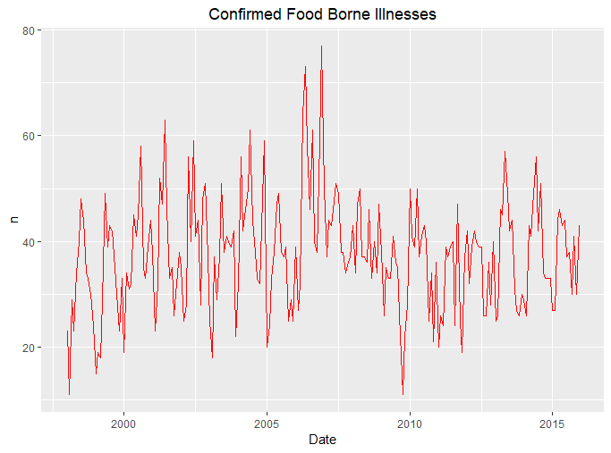
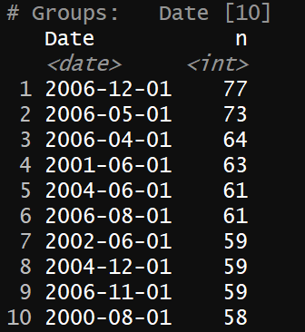
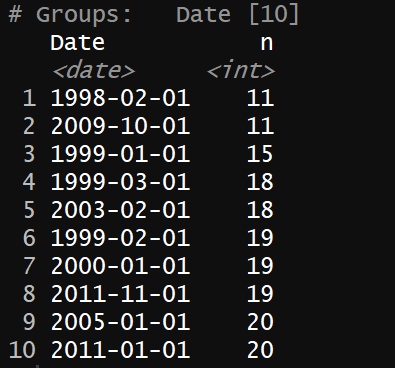
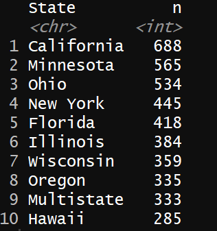
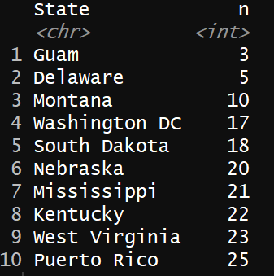
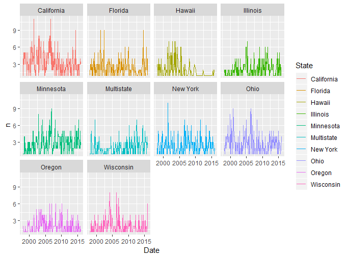
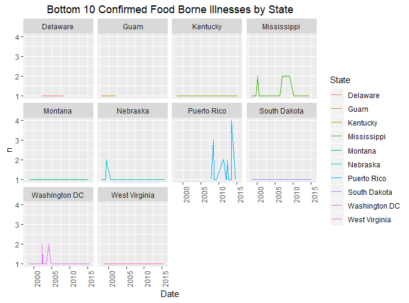
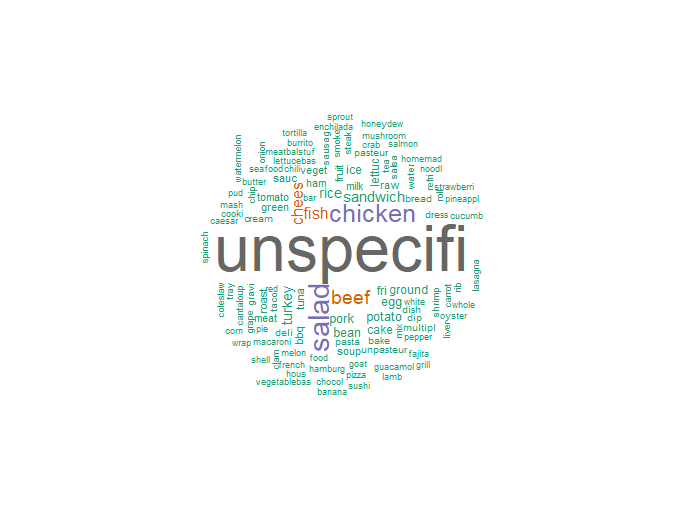

# Food Borne Illnesses


## Adrian Fletcher

### Overview
Contaminated food affects 1 in 6 Americans each year. An outbreak involves 2 or more individuals getting the same illness from the same source of food. 

This analysis will aim to explore:

* Are food-borne disease outbreaks increasing or decreasing? How is this affected by state? 
* What contaminant has been responsible for the most illnesses, hospitalizations, and deaths?
* What are the most common foods involved in food-borne illnesses?

### Data
The data are foodborne disease outbreaks from 1998-2015, procured from the Center of Disease Control and Prevention (CDC).  

```r
# install.packages("pacman")

#Load packages
pacman::p_load(
  tidyverse,
  zoo,
  tm,
  SnowballC,
  quanteda,
  RColorBrewer,
  wordcloud
)

#Load data & add in two columns
outbreak.data <- read_csv("./outbreaks.csv")

outbreak.data$confirmed <-
  str_detect(outbreak.data$Status, "Confirmed")


outbreak.data$Date <-
  as.Date(as.yearmon(paste(outbreak.data$Year, outbreak.data$Month), "%Y %b"))


#automatically updates all titles to center
theme_update(plot.title = element_text(hjust = 0.5))

#PLOT 1
outbreak.confirmed.plot <-  outbreak.data %>%
  group_by(Date) %>%
  filter(confirmed == TRUE) %>%
  count() %>%
  ggplot(aes(x = Date, y = n)) +
  geom_line(color="red") +
  ggtitle("Confirmed Food Borne Illnesses")
```




```r
#Top 10 highest values
upper.confirmation <- outbreak.data %>%
  group_by(Date) %>%
  filter(confirmed == TRUE) %>%
  count() %>%
  dplyr::arrange(-n) %>%
  head(10)
```



```r
#Top 10 lowest values
lower.confirmation <- outbreak.data %>%
  group_by(Date) %>%
  filter(confirmed == TRUE) %>%
  count() %>%
  dplyr::arrange(n) %>%
  head(10)
```


We will examine the top/bottom 10 states with food borne illnesses for brevity sake

```r
#Top 10 states with outbreaks
top.10.states <- outbreak.data %>%
  group_by(State) %>%
  filter(confirmed == TRUE) %>%
  count() %>%
  dplyr::arrange(-n) %>%
  head(10)
```



```r
bottom.10.states <- outbreak.data %>%
  group_by(State) %>%
  filter(confirmed == TRUE) %>%
  count() %>%
  dplyr::arrange(n) %>%
  head(10)
```



```r
top.10.state.plot <-  outbreak.data %>%
  group_by(Date, State) %>%
  filter(confirmed == TRUE, State %in% top.10.states$State) %>%
  count() %>%
  ggplot(aes(x = Date, y = n)) +
  geom_line(aes(color = State)) +
  ggtitle("Top 10 Confirmed Food Borne Illnesses by State") +
  theme(axis.text.x = element_text(angle = 90, hjust = 1))
```



```r
bottom.10.state.plot <-  outbreak.data %>%
  group_by(Date, State) %>%
  filter(confirmed == TRUE, State %in% bottom.10.states$State) %>%
  count() %>%
  ggplot(aes(x = Date, y = n)) +
  geom_line(aes(color = State)) +
  ggtitle("Bottom 10 Confirmed Food Borne Illnesses by State") +
  theme(axis.text.x = element_text(angle = 90, hjust = 1))
```



```r
#Food Cloud
food.table <- outbreak.data %>%
  group_by(Food) %>%
  filter(confirmed == TRUE, !is.na(Food)) %>%
  count()

food.corp <- food.table$Food
food.corp <- VCorpus(VectorSource(food.corp))
food.corp <- tm_map(food.corp, removePunctuation)
food.corp <- tm_map(food.corp, removeNumbers)
food.corp <-
  tm_map(food.corp, content_transformer(tolower) , lazy = TRUE)
food.corp <-
  tm_map(food.corp,
         content_transformer(removeWords),
         stopwords("english"))
food.corp <-
  tm_map(food.corp, content_transformer(stemDocument) , lazy = TRUE)
food.corp <- tm_map(food.corp, stripWhitespace)


dtm <- TermDocumentMatrix(food.corp)
dtms <-  removeSparseTerms(dtm, .995)

m <- as.matrix(dtms)
v <- sort(rowSums(m), decreasing = TRUE)
d <- data.frame(word = names(v), freq = v)

set.seed(1234)
wordcloud(
  words = d$word,
  freq = d$freq,
  min.freq = 1,
  max.words = 200,
  random.order = FALSE,
  rot.per = 0.35,
  colors = brewer.pal(8, "Dark2")
)
```


### Insights  

#### For the principal questions:

##### Are food-borne disease outbreaks increasing or decreasing? How is this affected by state?
* There does not seem to be a pattern of outbreaks. Each state varies widely by the amount of the Further analysis could be made to weight each state by population. 

##### What contaminant has been responsible for the most illnesses, hospitalizations, and deaths?
* The most illnesses can be attributed to Salmonella. The most hospitalizations can be attributed to Salmonella. The most deaths can be attributed to Listeria. 

##### What are the most common foods involved in food-borne illnesses?
* It appears that the most common food is unspecified, followed by salads, chicken, beef and cheese. These are not mainly related, but they do have a specifc care instructions in order to avoid illness. 

### Further Thoughts
* Each state could be weighted by their population. The largest states also have the largest amounts of reports, citing a bias in population. 

* This data may not account for private home/residences that decide to self treat after an infection. Additionally, deaths and illnesses that arise from food contamination might manifest into larger problems that are cited as the cause of death. 

* With more domain knowledge, a researcher can perform an LDA analysis on this dataset and group the top 10 common group of foods that are prevelant to cause illnesses. 

### Support or Contact

Adrian Fletcher is a graduate of the Wharton School of Business. Please direct any questions to flead+github@wharton.upenn.edu
